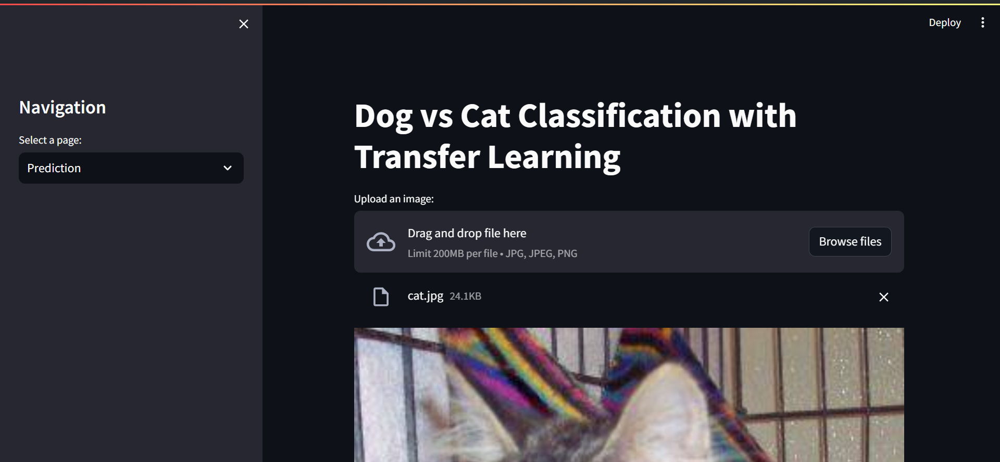
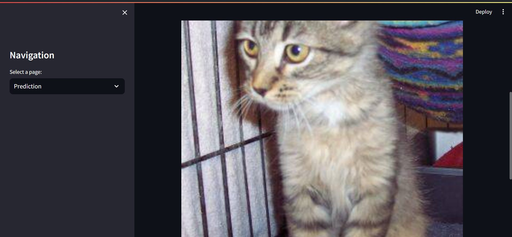
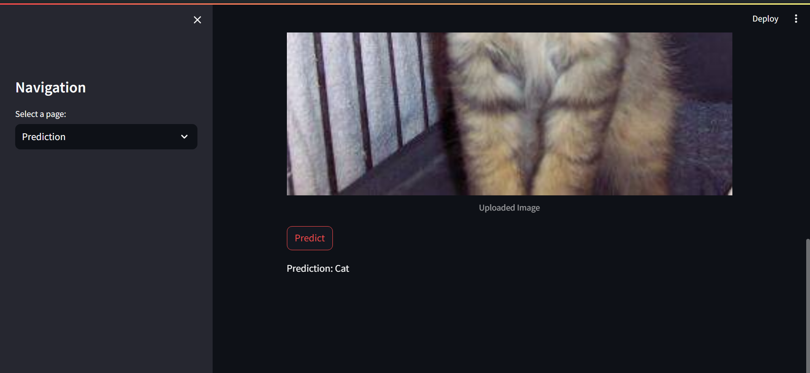
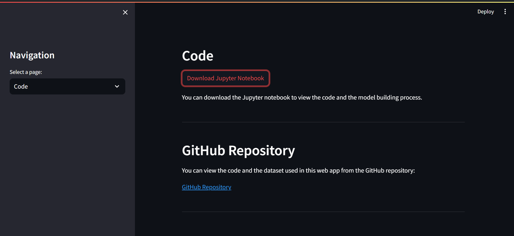
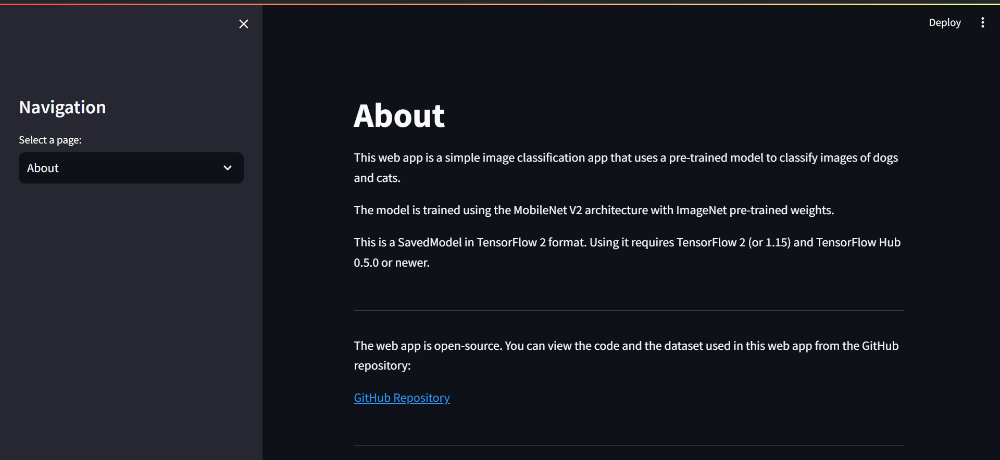

# Dog vs Cat Classification using Transfer Learning

This web app is a simple image classification app that uses a pre-trained model to classify images of dogs and cats.

The model is trained using the MobileNet V2 architecture with ImageNet pre-trained weights.

This is a SavedModel in TensorFlow 2 format. Using it requires TensorFlow 2 (or 1.15) and TensorFlow Hub 0.5.0 or newer.

